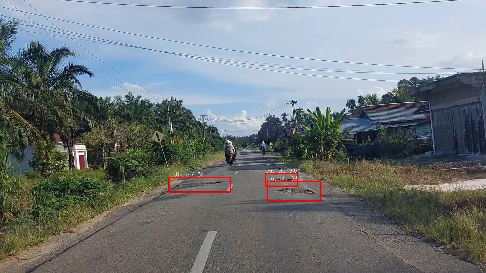
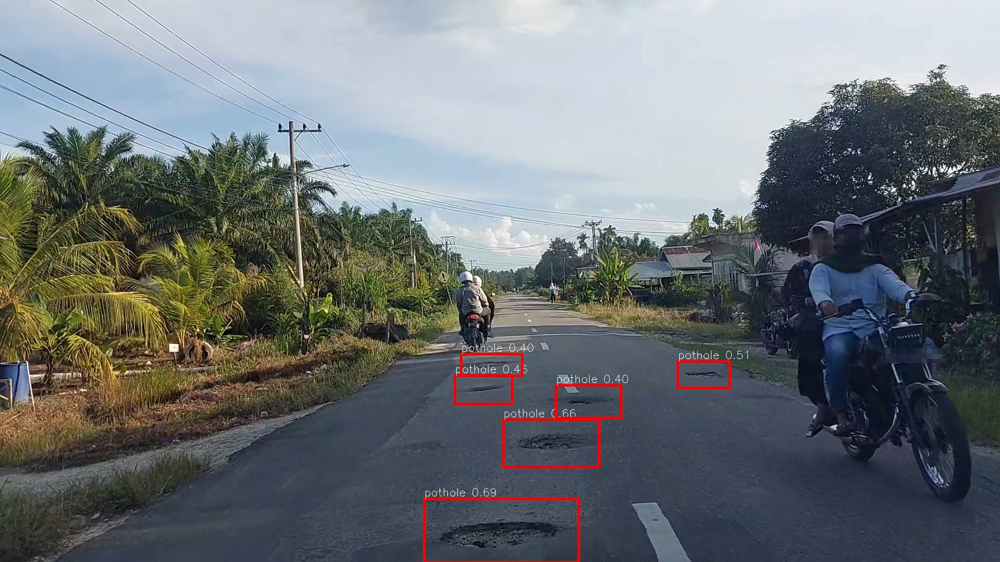

# **Pothole Detection with YOLO11s**

## **Overview**
This project focuses on detecting potholes from road images captured in a **dashcam-like perspective**, aimed at enhancing road safety and enabling early road maintenance interventions.  

The model is built on **YOLO11s**, a lightweight variant of the YOLOv11 family, selected for its balance of **real-time performance** and **accuracy**.  
The project employs a **multi-stage fine-tuning approach** and **experiment tracking** using MLflow to progressively improve the detection performance.

| Predicted_sample1 | Predicted_sample2 |
|-------------------|-------------------|
|  |  |


## **Key Features**
- **YOLO11s Base Model**: Optimized for real-time detection on edge devices.
- **Multi-Stage Fine-Tuning**: Five stages of progressive training to refine model performance.
- **Experiment Tracking with MLflow**: Detailed tracking of metrics, visualizations, and artifacts.
- **Custom Dataset**: Collected and processed road images with multiple aspect ratios for robustness.
- **Config-Driven Workflow**: Training, preprocessing, and inference pipelines managed entirely through YAML configurations.

---

## **Project Structure**
Below is the structure and purpose of each folder:

```
.
├── configs/                  # All configuration files
│   ├── dataset.yaml          # Dataset v1 configuration
│   ├── dataset_v2.yaml       # Dataset v2 configuration
│   ├── inference.yaml        # Inference configuration
│   ├── experiment_stage1/
│   │   ├── experiment.yaml
│   │   └── preprocessing.yaml
│   ├── experiment_stage2/
│   │   ├── experiment_v2.yaml
│   │   └── preprocessing_v2.yaml
│   ├── experiment_stage3/
│   │   ├── experiment_v2_ft1.yaml
│   │   └── preprocessing_v2_ft1.yaml
│   ├── experiment_stage4/
│   │   ├── experiment_v2_ft2.yaml
│   │   └── preprocessing_v2_ft2.yaml
│   └── experiment_stage5/
│       └── experiment_v2_ft3.yaml
│
├── data/                     # Dataset version 1 (16:9 aspect ratio)
│   ├── raw/                   # Unprocessed images and labels
│   │   └── sample/
│   │       ├── train/images/
│   │       └── val/images/
│   └── processed/             # Preprocessed dataset for YOLO
│       └── sample/
│           ├── train/images/
│           └── val/images/
│
├── data_v2/                  # Dataset version 2 (16:9, 1:1, 4:3 aspect ratios)
│   ├── raw/
│   │   └── sample/
│   │       ├── train/images/
│   │       └── val/images/
│   └── processed/
│       └── sample/
│           ├── train/images/
│           └── val/images/
│
├── models/
│   └── weights/              # Model weights
│       ├── best.pt           # Best performing model
│       └── last.pt           # Last epoch model
│
├── pre-trained/              # Base YOLO11s pre-trained weights
│   └── yolo11s.pt
│
├── results/                  # Experiment tracking and results
│   ├── experiment_pothole_detection_v1/
│   │   ├── pothole_yolo11s_v1/            # MLflow logs and artifacts
│   │   └── experiment_pothole_detection_v1.png
│   ├── experiment_pothole_detection_v2/
│   │   ├── pothole_yolo11s_v2/            # MLflow logs and artifacts
│   │   │   ├── pothole_yolo11s_v2
│   │   │   ├── pothole_yolo11s_v2_ft1
│   │   │   ├── pothole_yolo11s_v2_ft2
│   │   │   └── pothole_yolo11s_v2_ft3
│   │   └── experiment_pothole_detection_v2.png
│   └── inference/                        # Inference results
│       └── sample
│
├── src/
│   ├── inference.py           # Script for inference
│   ├── preprocessing.py       # Script for preprocessing images and labels
│   └── training.py            # Script for training process
│
├── cuda_check.py               # Utility script to check CUDA availability
├── requirements.txt            # Python dependencies
└── README.md
```

---

## **Workflow**

### **1. Pre-trained Model**
This project starts with a **YOLO11s** pre-trained model:
```
pre-trained/yolo11s.pt
```

> YOLO11s is chosen for its lightweight architecture, ideal for real-time detection in deployment scenarios such as vehicle-mounted dashcams.

---

### **2. Dataset Preparation**
This project uses **custom datasets that were entirely collected and labeled manually**, ensuring realistic representation of potholes under real-world driving conditions.

- **Data Collection**:  
  All images were **self-collected** using a smartphone camera mounted at a driver's point of view (POV), simulating a dashcam perspective.  
  Various lighting conditions, road surfaces, and framing variations were intentionally included to make the dataset more robust.

- **Annotation Tool**:  
  The labeling process was performed using **LabelImg**, generating YOLO-compatible `.txt` annotation files for each image.  
  Classes:
  - `pothole` → Road area containing a pothole.
  - `unpothole` (background) → Normal road without potholes (A.k.a. without bounding box).

- **Dataset Evolution**:  
  Two dataset versions were created as the project progressed:

| Dataset Version | Class Pothole Image | Background Image | Total Images | Aspect Ratios           | Purpose |
|-----------------|---------------------|------------------|--------------|--------------------------|---------|
| **Dataset v1**  | 585                 | 400              | 985          | 16:9                     | Initial development & testing |
| **Dataset v2**  | 815                 | 185               | 1000         | 16:9, 1:1, 4:3           | Expanded dataset for better generalization |

Each dataset follows this structure:
- **`raw/`** → Original unprocessed images and raw labels.  
- **`processed/`** → Cleaned and preprocessed data ready for YOLO11 training.

> **Privacy Note**:
This dataset contains private information such as visible license plates and human faces captured during data collection.
For privacy compliance, **the dataset cannot be made publicly available at this time**. However, a sample of the dataset can be seen in the [**`data/`**](data/) and [**`data_v2/`**](data_v2/) folders.

> A future anonymized version may be released after sensitive data is processed (e.g., blurring faces and license plates).

> **For other developers**:
You can still use this repository by providing your own dataset following the same structure and annotation format.

---

### **3. Multi-Stage Fine-Tuning**
The training is performed in **five stages**, each refining the model further.

| Stage | Config File Example                          | Description                      |
|-------|---------------------------------------------|----------------------------------|
| 1     | `configs/experiment_stage1/experiment.yaml` | Initial training on dataset v1. |
| 2     | `configs/experiment_stage2/experiment_v2.yaml` | Transition to dataset v2 with updated preprocessing. |
| 3     | `configs/experiment_stage3/experiment_v2_ft1.yaml` | First fine-tuning cycle. |
| 4     | `configs/experiment_stage4/experiment_v2_ft2.yaml` | Second fine-tuning cycle. |
| 5     | `configs/experiment_stage5/experiment_v2_ft3.yaml` | Final fine-tuning for production. |

---

### **4. Experiment Tracking with MLflow**
All training runs and fine-tuning stages are tracked using MLflow:
- Metrics (loss, accuracy, precision, recall)
- Confusion matrices
- Model artifacts
- Configuration snapshots

Example structure in `results/`:
```
results/experiment_pothole_detection_v2/
├── pothole_yolo11s_v2/
│   ├── pothole_yolo11s_v2
│   ├── pothole_yolo11s_v2_ft1
│   ├── pothole_yolo11s_v2_ft2
│   └── pothole_yolo11s_v2_ft3
└── experiment_pothole_detection_v2.png
```

---

## **Usage**
> **Note**: If you only want to run inference for the model, you can skip steps 3 and 4.

### **1. Create & Activate Virtual Environment**
```bash
python -m venv pothole_detection_venv
source pothole_detection_venv/bin/activate  # On Windows use `pothole_detection_venv\Scripts\activate`
```
---

### **2. Install Dependencies**
```bash
pip install -r requirements.txt
```

---

### **3. Preprocessing**
Run preprocessing with a specific config, example:
```bash
python src/preprocessing.py --config configs/experiment_stage2/preprocessing_v2.yaml --experiment configs/experiment_stage2/experiment_v2.yaml --log-level INFO
```

Arguments:
- `--config`: Path to the preprocessing configuration file. *Default*: `configs/experiment_stage1/preprocessing.yaml`
- `--experiment`: Path to the experiment configuration file. *Default*: `configs/experiment_stage1/experiment.yaml`
- `--log-level`: Logging level (`DEBUG`, `INFO`, `WARNING`, `ERROR`). *Default*: `INFO`

> You can replace the `--config` and `--experiment` paths depending on the stage or dataset you are working with. If these arguments are not specified, the script will automatically use the default configuration files.
---

### **3. Training**
Run training with a specific config, example:

```bash
python src/training.py --config configs/experiment_stage1/experiment.yaml
```

Arguments:
- `--config`: Path to the experiment configuration file. *Default*:configs/experiment_stage1/experiment.yaml

> You can replace the `--config` path depending on the stage or dataset you are training with. If this argument is not specified, the script will automatically use the default configuration file.

---

### **4. Inference**
Perform inference on validation images:
```bash
python src/inference.py --config configs/inference.yaml --preset accurate --input video.mp4 --output video_predict.mp4
```

Arguments:
- `--config`: Path to inference configuration file. *Default*: `configs/inference.yaml`.
This argument is optional since the script automatically uses the default configuration file if not specified.
- `--preset`: Inference mode preset. Options: `fast`, `balanced`, `accurate`. *Default*: `accurate`
- `--input`: Path to the input file video or directory.
- `--output`: Path to save the inference results. *Default*: `results/inference/`.
If only a directory is provided, the output video will be automatically named using the format `inference_<preset>.mp4`.

---

## **Results**
Visualizations and detailed reports are saved in the [**`results/`**](results/) folder.

Example:  
`results/experiment_pothole_detection_v2/experiment_pothole_detection_v2.png`  
This file contains an overview of experiments across all stages.

---

## **Future Improvements**
- Integration with **dashcam streaming** for real-time detection.
- Deployment pipeline for edge devices (e.g., Jetson Nano, Raspberry Pi).
- Continuous dataset expansion to improve generalization.
- Semi-supervised learning for leveraging unlabeled road images.

---

## **License**
This project is licensed under the MIT License. See [`LICENSE`](LICENSE) for more details.

